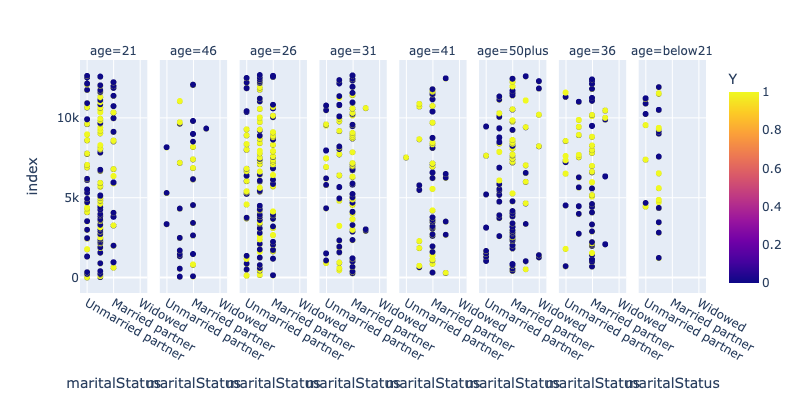
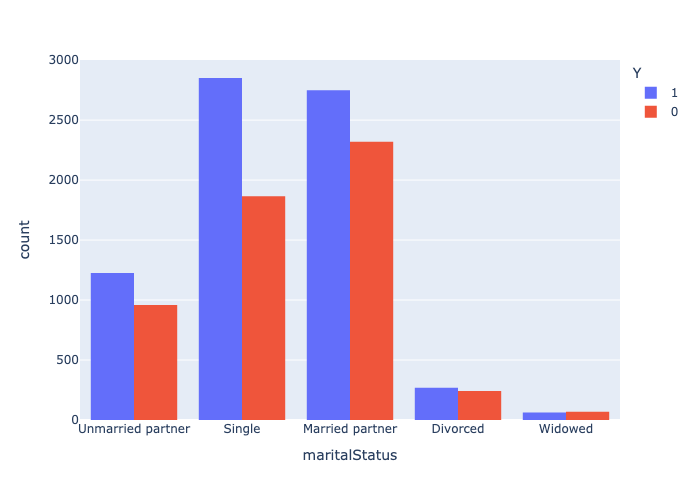
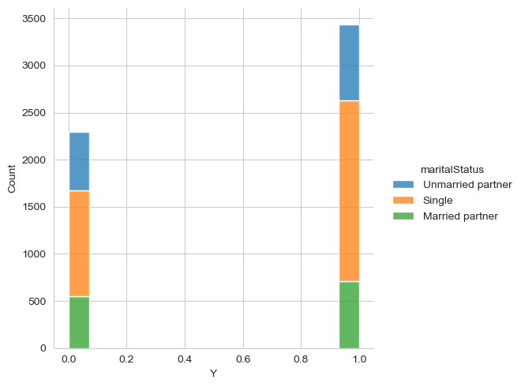
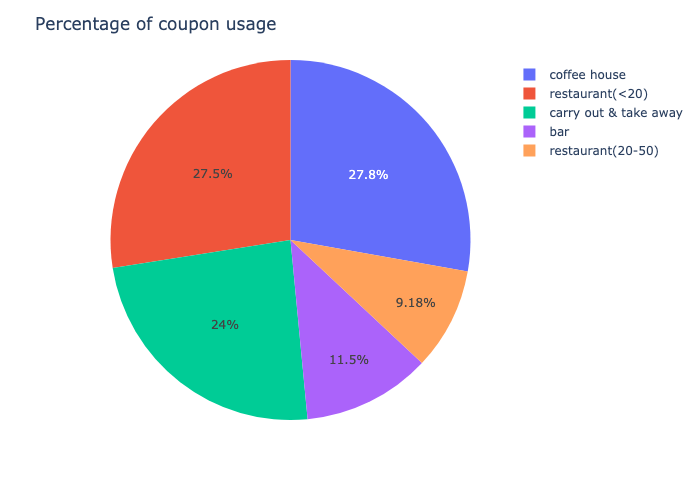

# Amazon_Truck_PA1
This is a Practical Application number 1 for machine learning course

Practical Application 5.1 - Will the Customer Accept the Coupon?
Question I explored: What factors drive acceptance of takeaway/carry-out coupons?
In this exercise, I wanted to explore what attributes differentiate customers who accept vs reject a coupon for takeaway/carry-out restaurants. I looked at three main factors:

What time of day the driver received the coupon
Where the driver was originally planning to go (work, home, or nowhere in particular)
Whether the restaurant was in the same or opposite direction from where the driver was originally planning to go
I explored these questions in this Jupyter notebook: https://github.com/Avinash-Gangwal/Amazon_Customer_Coupon

The project/repo contains the following files

1. coupons.csv:
A CSV named coupons.csv which has details of different coupons offered to drivers, their predicament at the time coupon was offered and the fact whather the coupon was offered or discarded

2. prompt.ipynb:
A jupyter notebook that summarizes the observations/inferences from CSV on the different trends for acceptance of Bar and Coffee Coupons and answering some of the questions that were asked in the assignment

As part of indepedent study I explore matrial status coupon groups and found that single people are most likely to accept the offer compared to any other.

This shows Carry out and take away has the highest acceptance rate compared to any other coupon type. 2nd is Restaurant(<20).

Overall conclution :
Overall 58% of drivers accept coupons
"Bar" Coupons are accepted more during 55º temperature
More the bar visits, higher the acceptance of bar coupon (77% acceptance opposed to drivers who have not been i.e. 37%
Higher the age and have visited bar, more likly they accept bar coupons
Singles accept more coupon than any other marital status
Carry out and take away has the highest acceptance rate compared to any other coupon type. 2nd is Restaurant(<20).
Coffee House has th maximum number of data.
less than 1% (0.85%) of drivers have provided car/driving details
Architecture & Engineering has highest number of count
Healthcare Support has the highest acceptance rate with 69.8347% compared to any other job
Retired job type has highest rejection rate with 54.1414%
Next Steps and Recommendations
Try to gather more data of car/vehical, that might provide more insights
Provide bar coupon based on weather conditions
Come up with geo-locations bassed on profession so that coupons are more targeted by driver professions
Restaurant(<20) has the second highest acceptane rate, provide more of that coupon
